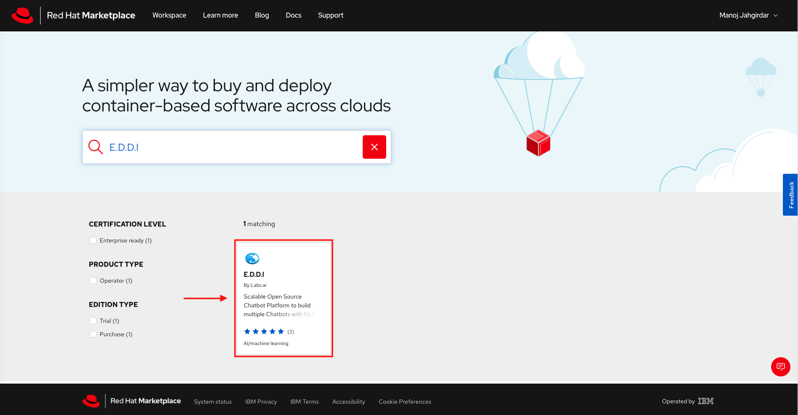
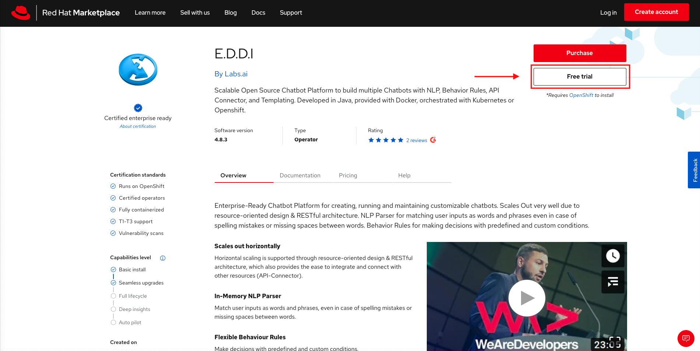
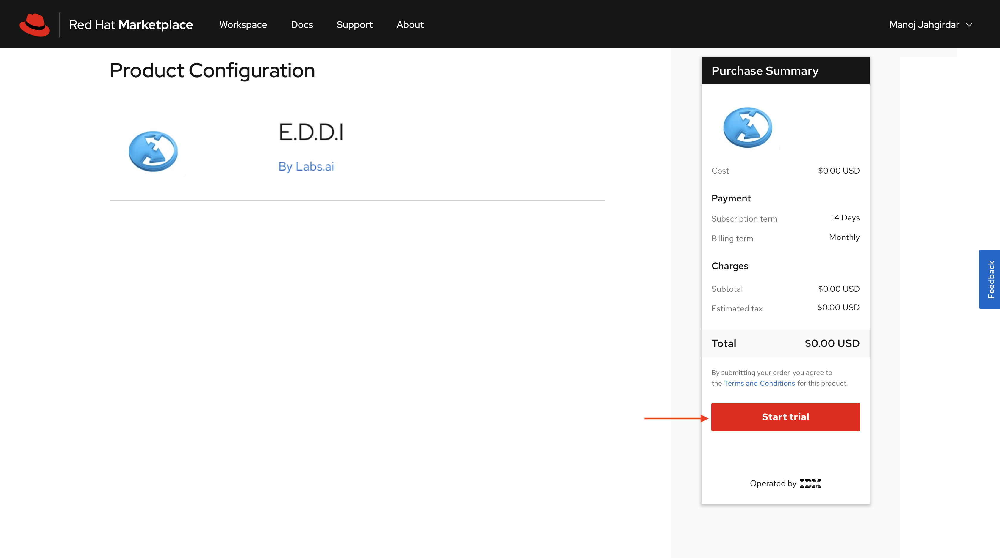
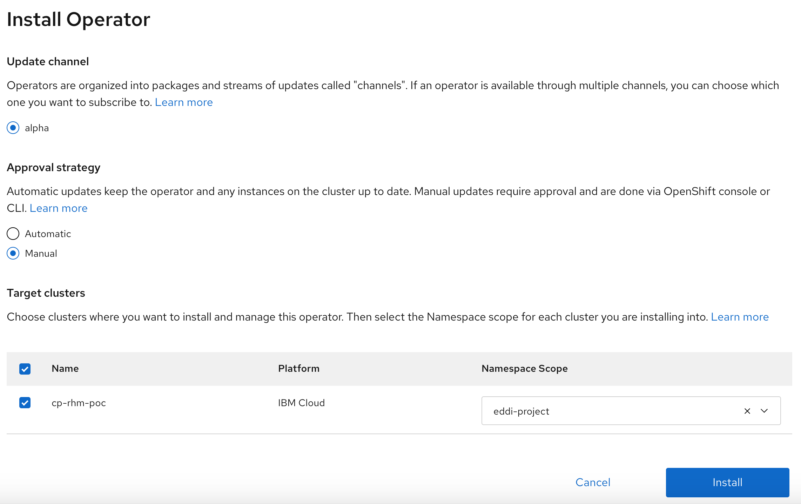
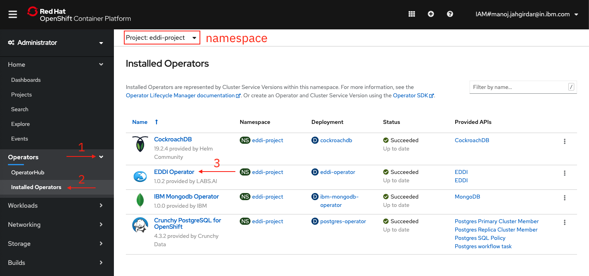
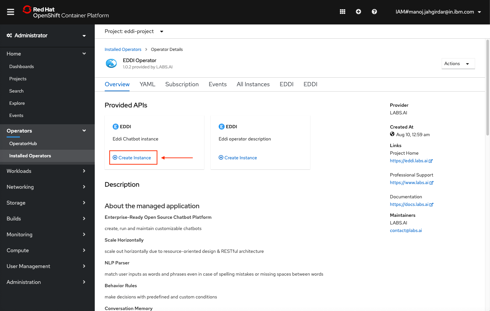
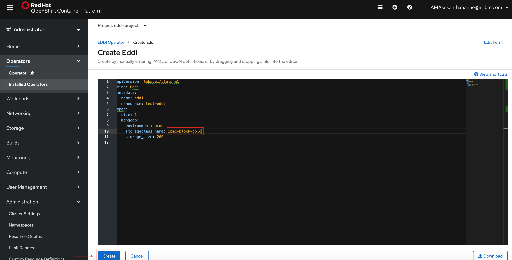
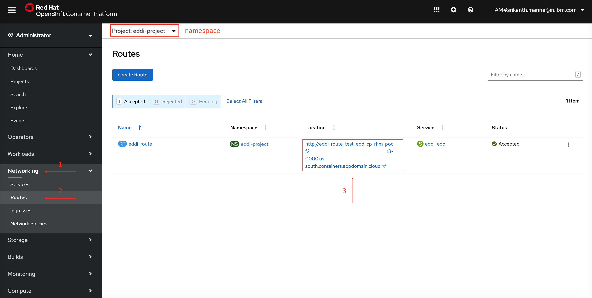
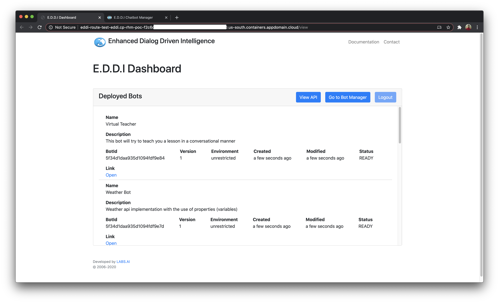

---
#Front matter (metadata).
abstract:               # REQUIRED

authors:
 - name: "Manoj Jahgirdar"
   email: "manoj.jahgirdar@in.ibm.com"
 - name: "Rahul Reddy Ravipally"
   email: "raravi86@in.ibm.com"
 - name: "Srikanth Manne"
   email: "srikanth.manne@in.ibm.com"
 - name: "Manjula G. Hosurmath"
   email: "mhosurma@in.ibm.com"

completed_date: 2020-01-20

components:
- slug: "eddi operator"
  name: "EDDI Operator"
  url: "https://marketplace.redhat.com/en-us/products/labsai"
  type: "component"
- slug: "redhat-marketplace"
  name: "Red Hat Marketplace"
  url: "https://marketplace.redhat.com/"
  type: "component"

draft: true|false       # REQUIRED

excerpt:                # REQUIRED

keywords:               # REQUIRED - comma separated list

last_updated:           # REQUIRED - Note: date format is YYYY-MM-DD

primary_tag:          # REQUIRED - Note: Choose only only one primary tag. Multiple primary tags will result in automation failure. Additional non-primary tags can be added below.

pta:                    # REQUIRED - Note: can be only one
# For a full list of options see https://github.ibm.com/IBMCode/Definitions/blob/master/primary-technology-area.yml
# Use the "slug" value found at the link above to include it in this content.
# Example (remove the # to uncomment):
 # - "cloud, container, and infrastructure"

pwg:                    # REQUIRED - Note: can be one or many
# For a full list of options see https://github.ibm.com/IBMCode/Definitions/blob/master/portfolio-working-group.yml
# Use the "slug" value found at the link above to include it in this content.
# Example (remove the # to uncomment):
# - "containers"

related_content:        # OPTIONAL - Note: zero or more related content
  - type: announcements|articles|blogs|patterns|series|tutorials|videos
    slug:

related_links:           # OPTIONAL - Note: zero or more related links
  - title:
    url:
    description:

runtimes:               # OPTIONAL - Note: Select runtimes from the complete set of runtimes below. Do not create new runtimes. Only use runtimes specifically in use by your content.
# For a full list of options see https://github.ibm.com/IBMCode/Definitions/blob/master/runtimes.yml
# Use the "slug" value found at the link above to include it in this content.
# Example (remove the # to uncomment):
 # - "asp.net 5"

series:                 # OPTIONAL
 - type:
   slug:

services:               # OPTIONAL - Note: please select services from the complete set of services below. Do not create new services. Only use services specifically in use by your content.
# For a full list of options see https://github.ibm.com/IBMCode/Definitions/blob/master/services.yml
# Use the "slug" value found at the link above to include it in this content.
# Example (remove the # to uncomment):
# - "blockchain"

subtitle:               # REQUIRED

tags:
# Please select tags from the complete set of tags below. Do not create new tags. Only use tags specifically targeted for your content. If your content could match all tags (for example cloud, hybrid, and on-prem) then do not tag it with those tags. Less is more.
# For a full list of options see https://github.ibm.com/IBMCode/Definitions/blob/master/tags.yml
# Use the "slug" value found at the link above to include it in this content.
# Example (remove the # to uncomment):
 # - "blockchain"

title:                  # REQUIRED

translators:             # OPTIONAL - Note: can be one or more
  - name:
    email:

type: tutorial

---

# Steps to Deploy E.D.D.I Operator from Red Hat Marketplace on OpenShift Cluster

### Step 1: Configure OpenShift Cluster(ROKS) with Red Hat Marketplace & Connect to the OpenShift Cluster in CLI (Command Line Interface)

- Refer the first two steps of the Tutorial to Configure Openshift Cluster(ROKS) with Red Hat Marketplace and Connect to the Openshift Cluster in CLI (Command Line Interface)
    - Tutorial Link: <https://github.com/IBM/rhm-operator-deployment-steps>

### Step 2: Deploy E.D.D.I Operator on OpenShift cluster

- E.D.D.I is a Scalable Open Source Chatbot Platform to build multiple Chatbots with NLP, Behavior Rules, API Connector, and Templating. Developed in Java, provided with Docker, orchestrated with Kubernetes or Openshift.

- Go to the [Marketplace catalog](https://marketplace.redhat.com/en-us) and search for E.D.D.I, Select `E.D.D.I` from the results as shown.



- The E.D.D.I product page gives you an overview, documentation, and pricing options associated with the product. Click on the `Free Trial` button as shown.



- Next, the purchase summary will show the `Subscription term` and total cost is $0.00. Click `Start trial` as shown.



> You can visit [Workspace > My Software](https://marketplace.redhat.com/en-us/workspace/software) to view your list of purchased softwares.

- Back in the **web dashboard**, select the **E.D.D.I tile** and then select the **Operators tab**. Click on the `Install Operator` button. Leave the default selection for **Update channel** and **Approval strategy**. Select the cluster and namespace scope as `eddi-project` for the operator and click `Install`.



- A message as shown below appears at the top of your screen indicating the install process initiated in the cluster.


### Step 4: Create an instance

- Log into your **OpenShift cluster** and look under `Operators > Installed Operators` to confirm the installation was successful.

- The operator `E.D.D.I Operator` should list under the project/namespace `cockroachdb-test` as shown.



- Click on `E.D.D.I` operator, under **Provided API's**, click on the first `Create Instance` as shown.



- The **Create E.D.D.I** page will be displayed with the default YAML, edit the `storageclass_name` in the YAML file, and click on the `Create` button as shown. If the default YAML file is not visiblie you can copy paste the bellow YAML file replacing the `storageclass_name`.

```yaml
apiVersion: labs.ai/v1alpha1
kind: Eddi
metadata:
  name: eddi
spec:
  size: 1
  mongodb:
    environment: prod
    storageclass_name: <existing_storageclass>
    storage_size: 20G
```



- E.D.D.I Operator pods should come up when the installation is completed.

- Under the left panel click on `Networking` and select `Routes`, make sure you are in the `eddi-project` namesapace, you can now see the `eddi-route` with a URL as shown.



- You can now visit the URL to access the E.D.D.I Dashboard.



# Reference
You can refer the following documentation from [E.D.D.I labs](https://docs.labs.ai/) to learn more about the operator and its features.

- <https://docs.labs.ai/redhat-openshift>